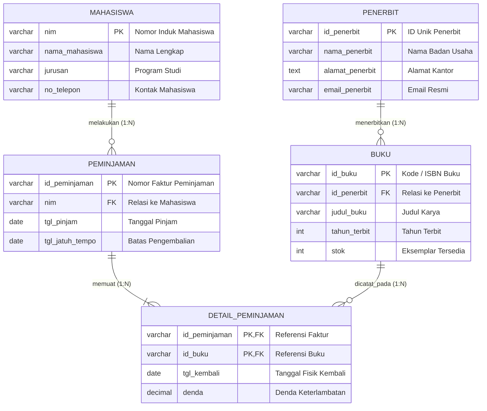

# DOKUMEN PERANCANGAN BASIS DATA (DATABASE DESIGN DOCUMENT)
**Sistem Informasi Pengelolaan Perpustakaan Terintegrasi (SIPUSTAKA)**

---

<!-- 1. Desain ERD Logis -->

# 1. Desain ERD Logis (Logical Entity Relationship Design)

## 1.1 Deskripsi Entitas Utama
Perancangan basis data logis sistem perpustakaan mengadopsi model relasional dengan entitas terstruktur untuk menjamin integritas data referensial dan efisiensi transaksi:

1. **Mahasiswa (`mahasiswa`)**: Entitas master pengguna (anggota perpustakaan) yang memiliki hak akses untuk melakukan transaksi peminjaman buku.
2. **Penerbit (`penerbit`)**: Entitas master yang mengelola informasi badan usaha atau lembaga yang menerbitkan karya literatur/buku.
3. **Buku (`buku`)**: Entitas master katalog literatur yang mencakup metadata bibliografi, identitas buku, serta kapasitas inventaris fisik (stok).
4. **Peminjaman (`peminjaman`)**: Entitas transaksi (*Header/Master Transaction*) yang merekam satu sesi peminjaman oleh seorang mahasiswa pada waktu tertentu.
5. **Detail Peminjaman (`detail_peminjaman`)**: Entitas asosiatif/transaksi (*Detail/Line Item Transaction*) yang menyelesaikan dekomposisi relasi *Many-to-Many* (1:N dan M:N) antara entitas `peminjaman` dan `buku`. Entitas ini melacak status individual tiap eksemplar buku, waktu pengembalian riil, serta kalkulasi sanksi denda keterlambatan.

---

## 1.2 Kardinalitas & Analisis Hubungan Antar Entitas (Relationship Analysis)

| No | Entitas Asal | Hubungan | Entitas Tujuan | Kardinalitas | Partisipasi (Modality) | Deskripsi Semantik Bisnis |
| :---: | :--- | :---: | :--- | :---: | :---: | :--- |
| **1** | `penerbit` | *menerbitkan* | `buku` | **1 : N (One-to-Many)** | Mandatory ke Optional | Satu penerbit dapat menerbitkan banyak judul buku (0..N). Setiap buku wajib diterbitkan oleh tepat satu penerbit (1..1). |
| **2** | `mahasiswa` | *melakukan* | `peminjaman` | **1 : N (One-to-Many)** | Optional ke Mandatory | Satu mahasiswa dapat memiliki 0 atau banyak riwayat transaksi peminjaman (0..N). Setiap transaksi peminjaman wajib dimiliki oleh tepat satu mahasiswa (1..1). |
| **3** | `peminjaman` | *memuat* | `detail_peminjaman` | **1 : N (One-to-Many)** | Mandatory ke Mandatory | Satu nota transaksi peminjaman wajib memuat minimal 1 atau beberapa eksemplar buku (1..N). Setiap record detail merujuk pada tepat satu nota peminjaman induk (1..1). |
| **4** | `buku` | *dicatat pada* | `detail_peminjaman` | **1 : N (One-to-Many)** | Optional ke Mandatory | Satu judul buku dapat dipinjam berkali-kali pada transaksi berbeda (0..N). Setiap entri detail wajib mereferensikan satu katalog buku tertentu (1..1). |

---

<!-- 2. Identifikasi Seluruh Atribut, Primary Key (PK), dan Foreign Key (FK) -->

# 2. Identifikasi Entitas, Atribut, Primary Key (PK), dan Foreign Key (FK)

Pemberian skema atribut disusun menggunakan konvensi penamaan standar database relasional (`snake_case`) dengan klasifikasi integritas kunci:

### 2.1 Entitas: `mahasiswa`
* **Deskripsi**: Menyimpan data identitas akademik anggota perpustakaan.
* **Atribut**:
  - `nim` (**Primary Key**): Nomor Induk Mahasiswa unik sebagai pengidentifikasi tunggal.
  - `nama_mahasiswa`: Nama lengkap mahasiswa.
  - `jurusan`: Program studi / jurusan akademik mahasiswa.
  - `no_telepon`: Nomor kontak aktif mahasiswa untuk keperluan notifikasi peminjaman/keterlambatan.

### 2.2 Entitas: `penerbit`
* **Deskripsi**: Menyimpan data identitas dan kontak legal penerbit buku.
* **Atribut**:
  - `id_penerbit` (**Primary Key**): Kode unik pengenal penerbit (misal: `PUB-001`).
  - `nama_penerbit`: Nama badan hukum / lembaga penerbitan.
  - `alamat_penerbit`: Alamat kantor operasional penerbit.
  - `email_penerbit`: Alamat surat elektronik resmi penerbit.

### 2.3 Entitas: `buku`
* **Deskripsi**: Menyimpan katalog master pustaka buku.
* **Atribut**:
  - `id_buku` (**Primary Key**): Kode identifikasi buku / barcode / ISBN unik.
  - `id_penerbit` (**Foreign Key** merujuk ke `penerbit.id_penerbit`): Kunci relasi ke tabel penerbit.
  - `judul_buku`: Judul literatur / buku lengkap.
  - `tahun_terbit`: Tahun publikasi edisi buku.
  - `stok`: Jumlah kuantitas eksemplar fisik yang tersedia di perpustakaan.

### 2.4 Entitas: `peminjaman`
* **Deskripsi**: Menyimpan informasi umum faktur / nota peminjaman (*Header Transaction*).
* **Atribut**:
  - `id_peminjaman` (**Primary Key**): Nomor registrasi transaksi peminjaman (misal: `TRX-2026-0001`).
  - `nim` (**Foreign Key** merujuk ke `mahasiswa.nim`): Kunci relasi mahasiswa peminjam.
  - `tgl_pinjam`: Tanggal efektif peminjaman dilakukan.
  - `tgl_jatuh_tempo`: Batas waktu tanggal pengembalian buku yang disepakati.

### 2.5 Entitas: `detail_peminjaman`
* **Deskripsi**: Menyimpan item detail buku yang dipinjam serta melacak status pengembalian (*Line Item Transaction*).
* **Atribut**:
  - `id_peminjaman` (**Composite Primary Key**, **Foreign Key** merujuk ke `peminjaman.id_peminjaman`): Referensi transaksi induk.
  - `id_buku` (**Composite Primary Key**, **Foreign Key** merujuk ke `buku.id_buku`): Referensi katalog buku yang dipinjam.
  - `tgl_kembali`: Tanggal riil buku dikembalikan secara fisik (bernilai `NULL` selama status buku masih dipinjam).
  - `denda`: Nominal denda finansial yang dihitung jika `tgl_kembali > tgl_jatuh_tempo` (default `0.00`).

--- 

<!-- 3. Simulasi Normalisasi (UNF -> 1NF -> 2NF -> 3NF) -->

# 3. Metodologi & Simulasi Normalisasi Basis Data

Proses normalisasi dilakukan secara formal dari *Unnormalized Form* (UNF) hingga mencapai *Third Normal Form* (3NF) guna menghilangkan anomali insersi (*insertion anomaly*), penghapusan (*deletion anomaly*), dan pembaruan (*update anomaly*), serta mereduksi redundansi data.

---

### 3.1 Unnormalized Form (UNF)
Kondisi data mentah (*flat file*) yang merekam transaksi dalam dokumen fisik/formulir peminjaman. Terdapat kelompok data yang berulang (*repeating groups*) pada atribut buku yang dipinjam per transaksi:

```text
(id_peminjaman, tgl_pinjam, tgl_jatuh_tempo, nim, nama_mahasiswa, jurusan, no_telepon,
 {id_buku, judul_buku, tahun_terbit, stok, id_penerbit, nama_penerbit, alamat_penerbit, email_penerbit, tgl_kembali, denda})
```

---

### 3.2 First Normal Form (1NF)
* **Syarat**: Setiap atribut harus bernilai atomik (tunggal, tidak dapat dipecah lagi), tidak ada duplikasi baris, dan menghilangkan *repeating groups*.
* **Tindakan**: Mendekomposisi kelompok berulang dengan membentuk **Composite Primary Key** dari `id_peminjaman` dan `id_buku`.

```text
(id_peminjaman*, id_buku*, tgl_pinjam, tgl_jatuh_tempo, nim, nama_mahasiswa, jurusan, 
 no_telepon, judul_buku, tahun_terbit, stok, id_penerbit, nama_penerbit, alamat_penerbit, 
 email_penerbit, tgl_kembali, denda)
```

---

### 3.3 Second Normal Form (2NF)
* **Syarat**: Sudah memenuhi kriteria 1NF dan **menghilangkan seluruh Ketergantungan Fungsional Parsial (*Partial Functional Dependency*)**. Setiap atribut non-kunci harus bergantung penuh (*fully functionally dependent*) pada seluruh atribut *primary key* komposit, bukan hanya sebagian.

**Analisis Ketergantungan Fungsional (Functional Dependency Analysis):**
1. **Parsial ke `id_peminjaman`**:
   `id_peminjaman` $\to$ `tgl_pinjam`, `tgl_jatuh_tempo`, `nim`, `nama_mahasiswa`, `jurusan`, `no_telepon`
2. **Parsial ke `id_buku`**:
   `id_buku` $\to$ `judul_buku`, `tahun_terbit`, `stok`, `id_penerbit`, `nama_penerbit`, `alamat_penerbit`, `email_penerbit`
3. **Penuh (*Full Dependency*) ke `(id_peminjaman, id_buku)`**:
   (`id_peminjaman`, `id_buku`) $\to$ `tgl_kembali`, `denda`

**Relasi Hasil Dekomposisi 2NF:**
* `Peminjaman_Header` (`id_peminjaman`*, `tgl_pinjam`, `tgl_jatuh_tempo`, `nim`, `nama_mahasiswa`, `jurusan`, `no_telepon`)
* `Buku_Master` (`id_buku`*, `judul_buku`, `tahun_terbit`, `stok`, `id_penerbit`, `nama_penerbit`, `alamat_penerbit`, `email_penerbit`)
* `Detail_Peminjaman` (`id_peminjaman`**, `id_buku`**, `tgl_kembali`, `denda`)

---

### 3.4 Third Normal Form (3NF)
* **Syarat**: Sudah memenuhi kriteria 2NF dan **menghilangkan seluruh Ketergantungan Fungsional Transitif (*Transitive Functional Dependency*)**. Atribut non-kunci tidak boleh bergantung pada atribut non-kunci lainnya ($X \to Y \to Z$).

**Identifikasi Ketergantungan Transitif:**
1. Pada `Peminjaman_Header`:
   `id_peminjaman` $\to$ `nim` $\to$ (`nama_mahasiswa`, `jurusan`, `no_telepon`)
   *Atribut identitas mahasiswa bergantung pada `nim`, bukan langsung pada `id_peminjaman`.*
   $\to$ **Solusi**: Pisahkan ke tabel master **`mahasiswa`** dan sisakan `nim` sebagai Foreign Key di tabel `peminjaman`.

2. Pada `Buku_Master`:
   `id_buku` $\to$ `id_penerbit` $\to$ (`nama_penerbit`, `alamat_penerbit`, `email_penerbit`)
   *Atribut profil penerbit bergantung pada `id_penerbit`, bukan langsung pada `id_buku`.*
   $\to$ **Solusi**: Pisahkan ke tabel master **`penerbit`** dan sisakan `id_penerbit` sebagai Foreign Key di tabel `buku`.

**Skema Relasi Akhir Hasil 3NF (Optimum):**
1. **`mahasiswa`**: (`nim`*, `nama_mahasiswa`, `jurusan`, `no_telepon`)
2. **`penerbit`**: (`id_penerbit`*, `nama_penerbit`, `alamat_penerbit`, `email_penerbit`)
3. **`buku`**: (`id_buku`*, `judul_buku`, `tahun_terbit`, `stok`, `id_penerbit`**)
4. **`peminjaman`**: (`id_peminjaman`*, `nim`**, `tgl_pinjam`, `tgl_jatuh_tempo`)
5. **`detail_peminjaman`**: (`id_peminjaman`**, `id_buku`**, `tgl_kembali`, `denda`)

---

<!-- 4. Susun rancangan tabel akhir dalam format tabel Markdown lengkap dengan tipe data -->

# 4. Spesifikasi Rancangan Skema Fisik (Data Dictionary & DDL Specification)

### 4.1 Tabel: `mahasiswa`
* **Primary Key**: `nim`
* **Foreign Key**: -

| Nama Kolom | Tipe Data | Nullability | Default | Constraint / Indeks | Deskripsi & Aturan Bisnis |
| :--- | :--- | :---: | :---: | :--- | :--- |
| `nim` | VARCHAR(15) | NOT NULL | - | **PRIMARY KEY** | Nomor Induk Mahasiswa (kombinasi unik angka & kode prodi). |
| `nama_mahasiswa` | VARCHAR(100) | NOT NULL | - | - | Nama lengkap mahasiswa sesuai data registrasi akademik. |
| `jurusan` | VARCHAR(50) | NOT NULL | - | - | Nama program studi/jurusan asal mahasiswa. |
| `no_telepon` | VARCHAR(15) | NULL | NULL | - | Nomor WhatsApp / kontak seluler aktif untuk reminder. |

---

### 4.2 Tabel: `penerbit`
* **Primary Key**: `id_penerbit`
* **Foreign Key**: -

| Nama Kolom | Tipe Data | Nullability | Default | Constraint / Indeks | Deskripsi & Aturan Bisnis |
| :--- | :--- | :---: | :---: | :--- | :--- |
| `id_penerbit` | VARCHAR(10) | NOT NULL | - | **PRIMARY KEY** | Kode identifikasi entitas penerbit (misal: `PUB-001`). |
| `nama_penerbit` | VARCHAR(100) | NOT NULL | - | - | Nama resmi percetakan / perusahaan penerbitan. |
| `alamat_penerbit` | TEXT | NULL | NULL | - | Alamat domisili kantor / operasional penerbit. |
| `email_penerbit` | VARCHAR(100) | NULL | NULL | - | Alamat email resmi untuk korespondensi bibliografi. |

---

### 4.3 Tabel: `buku`
* **Primary Key**: `id_buku`
* **Foreign Key**: `id_penerbit` merujuk ke `penerbit(id_penerbit)`

| Nama Kolom | Tipe Data | Nullability | Default | Constraint / Indeks | Deskripsi & Aturan Bisnis |
| :--- | :--- | :---: | :---: | :--- | :--- |
| `id_buku` | VARCHAR(15) | NOT NULL | - | **PRIMARY KEY** | Kode unik ISBN atau barcode katalog perpustakaan. |
| `id_penerbit` | VARCHAR(10) | NOT NULL | - | **FOREIGN KEY** (ON UPDATE CASCADE ON DELETE RESTRICT) | Referensi ke tabel penerbit buku yang bersangkutan. |
| `judul_buku` | VARCHAR(150) | NOT NULL | - | - | Judul lengkap katalog buku. |
| `tahun_terbit` | INT | NOT NULL | - | CHECK (`tahun_terbit` > 1800) | Tahun pencetakan/rilis buku. |
| `stok` | INT | NOT NULL | 0 | CHECK (`stok` >= 0) | Jumlah eksemplar fisik buku yang tersedia. |

---

### 4.4 Tabel: `peminjaman`
* **Primary Key**: `id_peminjaman`
* **Foreign Key**: `nim` merujuk ke `mahasiswa(nim)`

| Nama Kolom | Tipe Data | Nullability | Default | Constraint / Indeks | Deskripsi & Aturan Bisnis |
| :--- | :--- | :---: | :---: | :--- | :--- |
| `id_peminjaman` | VARCHAR(20) | NOT NULL | - | **PRIMARY KEY** | Nomor transaksi peminjaman unik (format: `TRX-YYYY-XXXXX`). |
| `nim` | VARCHAR(15) | NOT NULL | - | **FOREIGN KEY** (ON UPDATE CASCADE ON DELETE RESTRICT) | Referensi ke data mahasiswa yang meminjam buku. |
| `tgl_pinjam` | DATE | NOT NULL | CURRENT_DATE | - | Tanggal efektif peminjaman dilakukan. |
| `tgl_jatuh_tempo` | DATE | NOT NULL | - | CHECK (`tgl_jatuh_tempo` >= `tgl_pinjam`) | Tanggal batas akhir pengembalian tanpa sanksi denda. |

---

### 4.5 Tabel: `detail_peminjaman`
* **Primary Key**: Composite `(id_peminjaman, id_buku)`
* **Foreign Key**: 
  - `id_peminjaman` merujuk ke `peminjaman(id_peminjaman)`
  - `id_buku` merujuk ke `buku(id_buku)`

| Nama Kolom | Tipe Data | Nullability | Default | Constraint / Indeks | Deskripsi & Aturan Bisnis |
| :--- | :--- | :---: | :---: | :--- | :--- |
| `id_peminjaman` | VARCHAR(20) | NOT NULL | - | **COMPOSITE PK, FOREIGN KEY** (ON DELETE CASCADE) | Relasi ke faktur peminjaman induk. |
| `id_buku` | VARCHAR(15) | NOT NULL | - | **COMPOSITE PK, FOREIGN KEY** (ON DELETE RESTRICT) | Relasi ke eksemplar judul buku yang dipinjam. |
| `tgl_kembali` | DATE | NULL | NULL | - | Tanggal fisik buku dikembalikan (NULL jika masih dipinjam). |
| `denda` | DECIMAL(10,2) | NOT NULL | 0.00 | CHECK (`denda` >= 0) | Akumulasi biaya keterlambatan berdasarkan durasi hari. |

--- 

<!-- 5. Visualisasi Relasi Kunci (ERD) -->

# 5. Visualisasi Relasi Kunci (Entity Relationship Diagram)

### 5.1 Diagram Relasi Entitas ASCII (Monospace Box Layout)
> *Catatan: Gunakan mode full width / jendela lebar untuk tampilan optimal.*

```
+------------------------------------+                                +------------------------------------+
|             PENERBIT               |                                |             MAHASISWA              |
+------------------------------------+                                +------------------------------------+
| [PK] id_penerbit   : VARCHAR(10)   |                                | [PK] nim           : VARCHAR(15)   |
|      nama_penerbit : VARCHAR(100)  |                                |      nama_mahasiswa: VARCHAR(100)  |
|      alamat_penerbit: TEXT         |                                |      jurusan       : VARCHAR(50)   |
|      email_penerbit : VARCHAR(100) |                                |      no_telepon    : VARCHAR(15)   |
+------------------------------------+                                +------------------------------------+
                  | 1                                                                    | 1
                  |                                                                      |
                  | (1 : N) menerbitkan                                                  | (1 : N) melakukan
                  |                                                                      |
                  v N                                                                    v N
+------------------------------------+                                +------------------------------------+
|               BUKU                 |                                |             PEMINJAMAN             |
+------------------------------------+                                +------------------------------------+
| [PK] id_buku       : VARCHAR(15)   |                                | [PK] id_peminjaman : VARCHAR(20)   |
| [FK] id_penerbit   : VARCHAR(10)   |                                | [FK] nim           : VARCHAR(15)   |
|      judul_buku    : VARCHAR(150)  |                                |      tgl_pinjam    : DATE          |
|      tahun_terbit  : INT           |                                |      tgl_jatuh_tempo: DATE         |
|      stok          : INT           |                                +------------------------------------+
+------------------------------------+                                                   | 1
                  | 1                                                                    |
                  |                                                                      | (1 : N) memuat
                  | (1 : N) dicatat pada                                                 |
                  |                                                                      |
                  +--------------------------> [ RELASI ] <------------------------------+
                                                   |
                                                   v N
                                 +------------------------------------+
                                 |         DETAIL_PEMINJAMAN          |
                                 +------------------------------------+
                                 | [PK, FK] id_peminjaman: VARCHAR(20)|
                                 | [PK, FK] id_buku      : VARCHAR(15)|
                                 |          tgl_kembali  : DATE       |
                                 |          denda        : DECIMAL    |
                                 +------------------------------------+
```

---

### 5.2 Skrip Diagram Relasi Grafis (Format Standard GitHub Mermaid)


